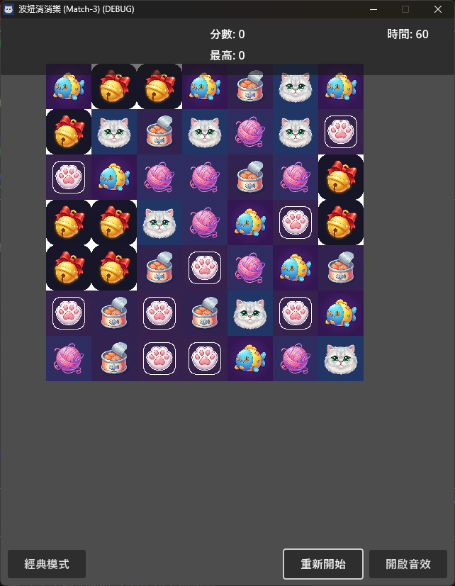

# match-3-game.Godot
一款以可愛貓咪（波弟）與可愛小女生(波妞)為主題用 Godot 開發的三消益智遊戲。



## 🎮 遊戲玩法

- **經典模式**：無限時間，直到沒有可消除的組合為止
- **計時模式**：60 秒內盡可能拿到高分
- **操作**：點擊或拖曳寶石進行交換，3 個以上相同即可消除

## 🛠️ 環境需求

- **Godot Engine**：4.2+（GL Compatibility 模式）
- **Node.js**：18.0+（如需使用 AI 輔助開發工具）

## 🤖 AI 輔助開發（godot-mcp）

本專案支援 `godot-mcp`，可讓 AI 代理直接與 Godot 編輯器互動（啟動編輯器、運行遊戲、抓取日誌、建立場景等）。
來源：<https://github.com/Coding-Solo/godot-mcp>

### 安裝步驟

1. **全域安裝 godot-mcp：**
   ```bash
   npm install -g @coding-solo/godot-mcp
   ```

2. **確認 Godot 路徑：**
   本專案預設 Godot 安裝在 `D:\Godot\4.2.2\Godot_v4.2.2-stable_win64.exe`
   
   如果你的路徑不同，請在 MCP 設定中修改 `GODOT_PATH` 環境變數。

### 在 AI 工具中啟用

將以下設定加入你的 AI 工具（Claude Desktop / Cursor / Cline）的 MCP 設定檔：

```json
{
  "mcpServers": {
    "godot": {
      "command": "npx",
      "args": ["-y", "@coding-solo/godot-mcp"],
      "env": {
        "GODOT_PATH": "D:\\Godot\\4.2.2\\Godot_v4.2.2-stable_win64.exe"
      }
    }
  }
}
```

> 💡 完整設定範例已存在於 `mcp-settings.json`

### 可用功能

| 功能 | 說明 | 指令範例 |
|------|------|----------|
| 啟動編輯器 | 自動開啟 Godot 編輯器 | `launch_editor` |
| 運行遊戲 | 啟動遊戲並抓取日誌 | `run_project` |
| 查看除錯輸出 | 讀取遊戲運行日誌 | `get_debug_output` |
| 停止遊戲 | 關閉運行中的遊戲 | `stop_project` |
| 建立場景 | 自動建立新場景檔案 | `create_scene` |
| 新增節點 | 在場景中新增節點 | `add_node` |

### 快速測試

在支援 MCP 的 AI 工具中，試著要求：

- 「幫我啟動 Godot 編輯器」
- 「運行這個遊戲並告訴我日誌裡有什麼」
- 「建立一個測試場景到 scenes/test.tscn」

> ⚠️ **注意**：Qwen Code 目前不支援 MCP，需使用 Claude Desktop、Cursor 或 Cline 等工具。

## 📚 文件指南

- [docs/GODOT_MCP_GUIDE.md](docs/GODOT_MCP_GUIDE.md)：`godot-mcp` 的完整使用指南，包含安裝、設定、常用指令與除錯流程。
- [docs/GODOT_PORTING_GUIDE.md](docs/GODOT_PORTING_GUIDE.md)：專案移植指南，說明跨環境搬移時的設定差異、資源路徑與相容性注意事項。

## 🎬 影片格式轉換

Godot 4 的 `VideoStreamPlayer` 不支援 MP4 格式，需轉換為 WebM (VP9)：

```bash
ffmpeg -i assets/videos/cheer.mp4 -c:v libvpx-vp9 assets/videos/cheer.webm
```

轉換完成後需更新資源引用路徑。

## 📁 專案結構

```
match-3-game.Godot/
├── assets/           # 圖片、音效、影片等資源
├── resources/        # 字型、主題等設定
├── scenes/           # 遊戲場景（board, game, gem, ui）
├── scripts/          # GDScript 程式碼
│   ├── main.gd           # 主場景控制器
│   ├── game.gd           # 遊戲邏輯核心
│   ├── board.gd          # 棋盤管理
│   ├── gem.gd            # 寶石節點
│   ├── ui_controller.gd  # UI 介面控制
│   ├── audio_manager.gd  # 音效管理
│   └── constants.gd      # 遊戲常數
├── main.tscn         # 主場景
└── project.godot     # 專案設定
```
